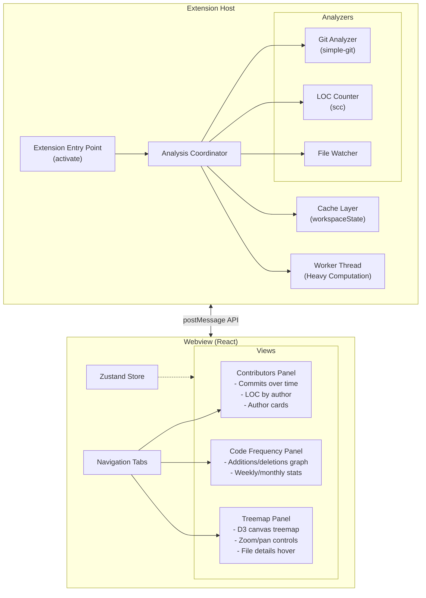
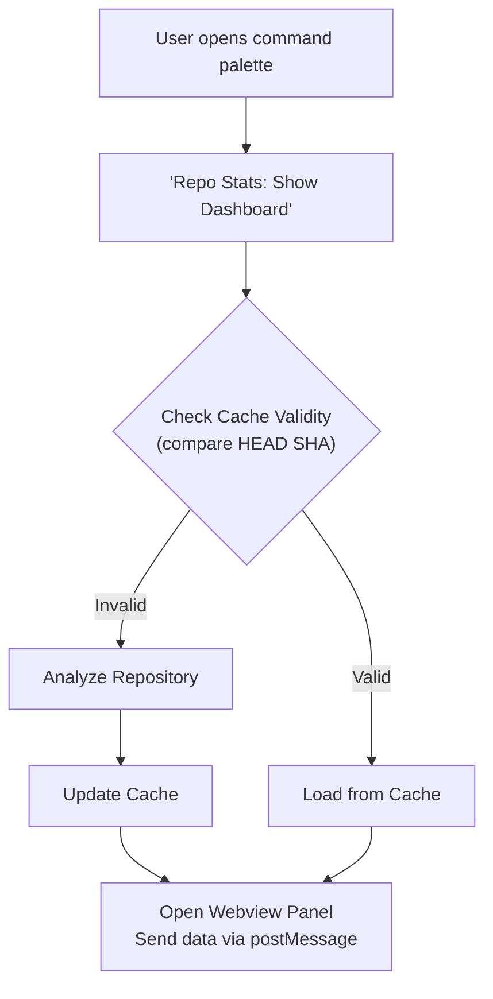
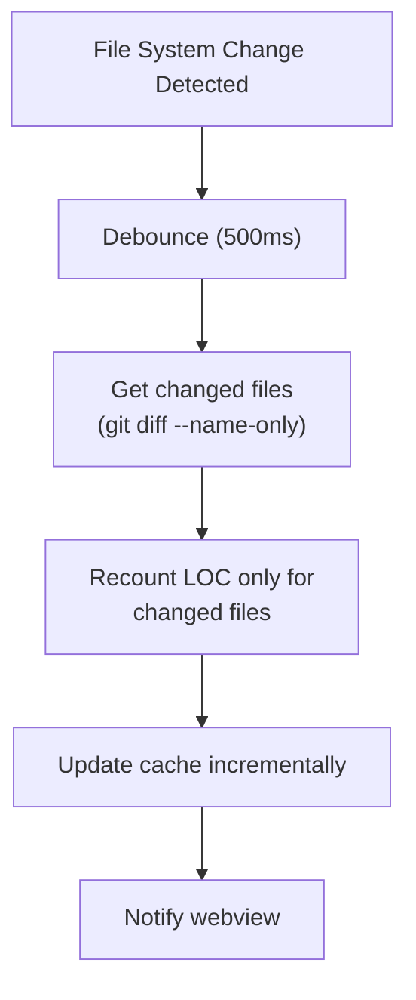

# VSCode Repo Stats - Architecture

## Overview

A high-performance VSCode extension for visualizing repository statistics, including:
- **Contributors Dashboard**: LOC per contributor, commits over time (like GitHub Insights)
- **Code Frequency Graph**: Additions/deletions over time
- **Repository Treemap**: Visual map of codebase by lines of code (like WizTree)

Feature specifications are documented in [SPECIFICATIONS.md](./SPECIFICATIONS.md).

---

## Tech Stack

### Extension Core
| Component | Technology | Rationale |
|-----------|------------|-----------|
| Language | TypeScript | Type safety, VSCode native support |
| Build Tool | esbuild | Fast builds, excellent for extensions |
| Git Operations | simple-git | Easy API, well-maintained |
| LOC Counting | scc (binary) | Fastest LOC counter, handles 150+ languages |
| Background Processing | Node.js Worker Threads | CPU-intensive operations off main thread |
| Caching | VSCode workspaceState | Persistent per-workspace cache |

### Webview (UI)
| Component | Technology | Rationale |
|-----------|------------|-----------|
| Framework | React + TypeScript | Component reuse, excellent tooling |
| Bundler | Vite | Fast HMR, optimized production builds |
| UI Components | VSCode Webview UI Toolkit | Native VSCode look and feel |
| Treemap Visualization | D3.js (d3-hierarchy) | Full control, canvas rendering for performance |
| Charts | Plotly.js | Interactive time-series, minimal setup |
| State Management | Zustand | Lightweight, simple API |

---

## Architecture Diagram



---

## Data Flow

### Initial Analysis Flow



### Incremental Update Flow



---

## Component Responsibilities

| Component | Owns | Does NOT Own |
|-----------|------|--------------|
| Analysis Coordinator | Orchestrating analysis, progress reporting | Direct git/LOC operations |
| Git Analyzer | Commit data, author info, diffs | LOC counting, caching |
| LOC Counter | File/directory line counts via scc | Git operations, caching |
| Cache Manager | Persistence, cache invalidation | Data computation |
| File Watcher | Change detection, debouncing | Analysis logic |
| Worker Thread | Heavy computation (aggregation, stats) | I/O operations |
| Webview Provider | Panel lifecycle, message routing | UI rendering |

---

## Performance Strategies

### Progressive Loading

| Phase | Data Loaded | Target |
|-------|-------------|--------|
| Phase 1 | Basic repo info (name, branch, commit count) | Immediate |
| Phase 2 | Top 10 contributors, recent commits | < 1 second |
| Phase 3 | Full contributor stats, code frequency | Background |
| Phase 4 | Complete treemap data | Background |

### Caching Strategy

- Cache keyed by repository path
- Invalidated when HEAD SHA changes
- Per-file LOC cached with blob SHA for incremental updates
- Cache schema versioned for migration support

### Worker Thread Usage

Heavy computations offloaded to worker:
- Commit history aggregation (parsing thousands of commits)
- Statistics calculations (contributor rankings, trends)
- Treemap data transformation (hierarchical structure building)
- LOC aggregation by directory

### Lazy Treemap Rendering

- Initial render shows top 2 directory levels only
- Children loaded on-demand when user clicks to zoom
- Canvas rendering with requestAnimationFrame for smooth 60fps interaction
- Batch rendering (500 nodes per frame) for large datasets

---

## Data Models

### Contributor Stats
```typescript
interface ContributorStats {
  name: string;
  email: string;
  avatarUrl?: string;
  commits: number;
  linesAdded: number;
  linesDeleted: number;
  firstCommit: Date;
  lastCommit: Date;
  weeklyActivity: WeeklyCommit[];
}

interface WeeklyCommit {
  week: string;              // ISO week (2025-W03)
  commits: number;
  additions: number;
  deletions: number;
}
```

### Code Frequency
```typescript
interface CodeFrequency {
  week: string;              // ISO week
  additions: number;
  deletions: number;
  netChange: number;
}
```

### Treemap Node
```typescript
interface TreemapNode {
  name: string;              // File or directory name
  path: string;              // Full path from repo root
  type: 'file' | 'directory';
  lines?: number;            // LOC (files only)
  language?: string;         // Detected language
  lastModified?: Date;       // For age-based coloring
  children?: TreemapNode[];
}
```

### Cache Structure
```typescript
interface CacheStructure {
  version: string;           // Cache schema version
  repoPath: string;
  lastCommitSha: string;     // HEAD SHA for invalidation
  lastAnalyzed: number;      // Timestamp
  contributors: ContributorStats[];
  codeFrequency: CodeFrequency[];
  fileTree: TreemapNode;
  fileLOC: Record<string, {
    sha: string;             // File blob SHA
    lines: number;
    language: string;
  }>;
}
```

---

## Implementation Phases

### Phase 1: Foundation (MVP)
- [ ] Extension scaffolding with esbuild
- [ ] Basic webview with React + Vite
- [ ] simple-git integration
- [ ] Basic contributor stats (commits only)
- [ ] Simple commits over time chart

### Phase 2: Core Features
- [ ] scc integration for LOC counting
- [ ] Code frequency graph
- [ ] Worker thread implementation
- [ ] Caching layer

### Phase 3: Treemap
- [ ] D3 treemap with canvas rendering
- [ ] Zoom and pan controls
- [ ] File details on hover
- [ ] Language color coding
- [ ] Age-based color mode

### Phase 4: Polish
- [ ] Progressive loading UI
- [ ] Incremental updates
- [ ] Settings and configuration
- [ ] Error handling and edge cases

### Phase 5: Release
- [ ] Documentation
- [ ] Marketplace assets
- [ ] Performance profiling
- [ ] Cross-platform testing

---

## Open Questions

1. **GitHub API Integration**: Should we fetch contributor avatars from GitHub? Adds visual appeal but requires API tokens for private repos.

2. **Blame Analysis**: Should we add per-file blame to show "who wrote this code"? Expensive operation but valuable data.

3. **Historical Treemaps**: Allow viewing treemap at different points in history? Significant complexity increase.

4. **Export Options**: Should users be able to export stats as CSV/JSON/PDF?

5. **Comparison Mode**: Compare stats between branches or time periods?
