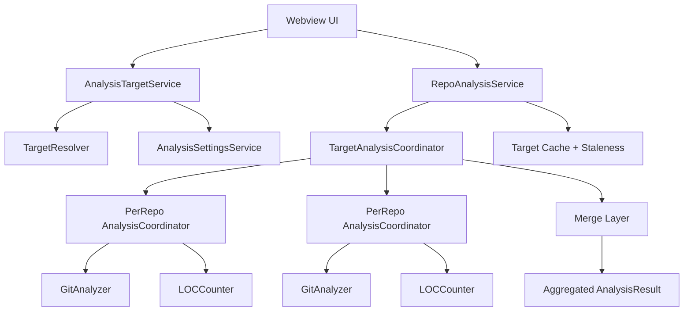

# Multi-Repo Analysis Plan

## Goal

Replace the current submodule special case with a general **analysis target** model that can aggregate:

- one repository
- one repository + its submodules
- multiple repositories in a workspace
- future custom repo groups

Result: no more "submodules only affect file tabs" branch logic in core analyzers or UI. Submodules become one member type inside a broader multi-repo architecture.

## Why change

Current model has one-off submodule handling baked into single-repo code:

- `src/analyzers/coordinator.ts`
  - detects submodules
  - excludes submodule paths from LOC unless `includeSubmodules` is enabled
  - still computes git-history tabs from only the parent repo
- `src/shared/contracts.ts`
  - `AnalysisResult` has singular `repository`
  - `submodules` is metadata, not a real analysis input model
- `webview-ui/src/components/*`
  - Contributors / Code Frequency / Evolution render special-case warning banners
- cache + staleness
  - keyed by one repo path / one repo HEAD
- selection model
  - user selects a single repository, not an analysis target

That shape cannot scale cleanly to:

- parent repo + submodules
- workspace with multiple repos
- future repo groups / compare sets / bookmarked bundles

## Design principles

1. **Single repo remains the trivial case**
   - one-member target
   - no duplicate logic path
2. **Submodules are not special in analyzers**
   - they are just target members discovered by a resolver
3. **Per-repo clients stay per-repo**
   - `GitAnalyzer` / `LOCCounter` remain scoped to one physical git repo
   - aggregation happens one layer up
4. **Target selection decides membership**
   - analyzers do not decide whether submodules exist or should be included
5. **Settings and caches become target-aware**
   - no hidden coupling to a single repo path / SHA
6. **Partial-data rules stay explicit**
   - if a target shape is only partly supported during rollout, expose diagnostics; do not silently degrade

## Proposed architecture

### 1) New core abstraction: `AnalysisTarget`

Add a target contract that describes **what** is being analyzed.

```ts
interface AnalysisTarget {
  id: string;
  kind: 'repository' | 'repositoryWithSubmodules' | 'workspace' | 'customGroup';
  label: string;
  settingsAnchor: AnalysisSettingsAnchor;
  members: AnalysisTargetMember[];
}

interface AnalysisTargetMember {
  id: string;
  role: 'primary' | 'submodule' | 'workspaceRepo' | 'groupRepo';
  repoPath: string;
  displayName: string;
  logicalRoot: string;
  pathPrefix: string;
  workspaceFolderName?: string;
}

interface AnalysisSettingsAnchor {
  kind: 'repo' | 'workspace';
  repoPath?: string;
  workspaceFolderName?: string;
}
```

Key idea:

- **physical repo path** = where git/scc run
- **logical root / path prefix** = where that repo appears inside the aggregated result

Examples:

- single repo target
  - members: one repo
  - `pathPrefix = ''`
- repo + submodules target
  - parent repo: `pathPrefix = ''`
  - submodule at `vendor/lib-a`: `pathPrefix = 'vendor/lib-a'`
- workspace target
  - each repo gets a stable prefix, e.g. `repo-name/` or workspace-relative path

### 2) Split responsibilities into layers



### 3) Keep per-repo analyzers; add an aggregate coordinator

Do **not** mutate `GitAnalyzer` into a multi-repo object.

Instead:

- keep `GitAnalyzer` per repo
- keep `LOCCounter` per repo
- add `TargetAnalysisCoordinator`
  - creates one per-repo coordinator/client per member
  - runs member analysis steps
  - merges results into one target-level result

That avoids spaghetti in current repo-local code.

## Data model changes

### Replace singular repository result shape

Current:

- `AnalysisResult.repository`
- `AnalysisResult.submodules?`

Proposed:

```ts
interface AnalysisTargetInfo {
  id: string;
  kind: AnalysisTarget['kind'];
  label: string;
  memberCount: number;
}

interface AnalyzedRepositoryInfo extends RepositoryInfo {
  id: string;
  role: AnalysisTargetMember['role'];
  logicalRoot: string;
  pathPrefix: string;
}

interface AnalysisResult {
  target: AnalysisTargetInfo;
  repositories: AnalyzedRepositoryInfo[];
  contributors: ContributorStats[];
  codeFrequency: CodeFrequency[];
  commitAnalytics: CommitAnalytics;
  fileTree: TreemapNode;
  analyzedAt: string;
  analyzedCommitCount: number;
  maxCommitsLimit: number;
  limitReached: boolean;
  sccInfo: SccInfo;
  blameMetrics: BlameMetrics;
  diagnostics?: AnalysisDiagnostics;
}
```

### Remove `submodules` metadata as a behavior driver

`submodules` can remain temporarily for migration/UI copy, but target membership should become the source of truth.

End state:

- no `includeSubmodules` checks in analyzers
- no `data.submodules` checks in Contributors / Frequency / Evolution / Files banners
- UI derives context from `result.target` + `result.repositories`

### Extend commit analytics records with repo identity

For aggregated targets, merged commit analytics should preserve origin.

Add to `CommitRecord`:

```ts
repositoryId: string;
```

Reason:

- future commit explorer can filter by repo within a target
- large workspace targets remain explainable
- merged metrics remain debuggable

## Aggregation model by tab

### A. Overview / Files / Treemap / blame

Implementation shape:

1. run LOC + tracked-file + blame flows per repo member
2. rewrite each file path with its `pathPrefix`
3. merge trees into one target root
4. aggregate blame metrics across all prefixed files

Notes:

- submodule inclusion stops being a LOC exclusion hack
- workspace multi-repo targets naturally work the same way
- files table should gain a derived repo column when `memberCount > 1`

### B. Contributors / Code Frequency / Commit Analytics

Implementation shape:

1. run `getCommitAnalytics()` per repo member
2. merge commit records into one combined `CommitAnalytics`
3. rebuild derived views from the merged analytics using shared helpers

Needed helper additions in `src/analyzers/commitAnalytics.ts`:

- `mergeCommitAnalytics(analytics: CommitAnalytics[]): CommitAnalytics`
- internal author merge keyed by normalized email
- bucket/index rebuild after merge

Important semantic choice:

- interpret `maxCommitsToAnalyze` as **per repository**, not across the whole target

Why:

- total-target cap makes large repos starve smaller repos
- per-repo cap composes cleanly
- existing single-repo behavior stays unchanged

Diagnostics to expose:

- total commits analyzed across all members
- per-member truncation count / whether the limit was hit

### C. Evolution

This is the hardest part. It needs a true target timeline, not a parent-repo shortcut.

#### Proposed model

Build a **merged event timeline** across all target members.

Each event:

```ts
interface TargetHistoryEvent {
  repositoryId: string;
  commitSha: string;
  timestamp: number;
  branch: string;
}
```

Sampling rules:

- `time`: sample target dates across the merged timeline
- `commit`: sample every Nth merged event
- `auto`: downsample merged events evenly

For each sampled target point:

- determine, for every repo member, the latest commit at or before that target time/event
- update only the repos whose selected commit changed since the previous snapshot
- merge member histograms into one target histogram

#### Evolution contract changes

Current `EvolutionResult` assumes one `branch` + one `headSha`.

That does not generalize.

Proposed direction:

```ts
interface EvolutionTargetRevision {
  targetId: string;
  historyMode: 'singleBranch' | 'mergedMembers';
  memberHeads: Array<{
    repositoryId: string;
    branch: string;
    headSha: string;
  }>;
  revisionHash: string;
}
```

`EvolutionSnapshotPoint` should stop pretending every snapshot maps to one branch commit. Keep:

- `committedAt`
- target-level event index / total count
- sampling mode
- optional anchor event (`repositoryId`, `commitSha`) for tooltip/debugging

#### Rollout recommendation

Do not ship a fake aggregate Evolution mode.

Ship only when:

- target snapshots are truly merged
- staleness works across all member heads
- tooltip text explains merged history clearly

## Selection model

### Replace repository picker with target picker

Current picker chooses one repository path.

New picker should choose one `AnalysisTarget`.

Examples:

- `repo-stats`
- `repo-stats + 3 submodules`
- `Workspace repositories (4)`
- future: `Bookmarked group: frontend stack`

Implementation split:

- `RepositoryService` keeps discovering physical repos
- new `AnalysisTargetService` builds target options from discovered repos
- persisted state stores `selectedTargetId`, not `selectedRepoPath`

## Settings model

## Problem

`includeSubmodules` is the wrong abstraction.

It is:

- repo-specific
- file-analysis-specific
- not expressive enough for workspace aggregation

## Proposed direction

Replace it with target selection, not another boolean.

- target membership belongs to the **selection model**
- analysis behavior belongs to **settings**

Meaning:

- no `repoStats.includeSubmodules`
- selected target decides whether submodules participate
- same analyzers work for single repo / repo+submodules / workspace

### Settings anchor behavior

Use the target's `settingsAnchor`:

- single repo target -> existing repo/workspace-folder settings behavior
- repo + submodules target -> anchored to the parent repo
- workspace target -> anchored at workspace/global scope only

This keeps repo-scoped settings valid where they make sense, without inventing fake repo overrides for workspace-wide aggregates.

## Cache + staleness plan

### Core cache

Current cache key: one repo path hash.

Proposed cache key: target id + member revision hash.

```ts
cacheKey = hash({
  targetId,
  memberRepoPaths,
  memberHeadShas,
  settingsHash,
  cacheVersion,
})
```

### Blame cache

Blame reuse is best kept **per physical repo**, not per target.

Reason:

- same repo can participate in multiple targets
- blob SHA reuse should survive target changes

Recommendation:

- move blame cache identity to `(repoPath, blobSha, relativePath)`
- target-level result cache references reused per-repo blame data

### Evolution cache

Use target revision hash derived from all member heads, not one `HEAD`.

## Migration plan

### Phase 0 — scaffolding

1. add `AnalysisTarget` contracts
2. add `AnalysisTargetService`
3. persist selected target id
4. introduce target-aware cache key helpers
5. keep old UI behavior temporarily

### Phase 1 — core multi-repo aggregation

1. add `TargetAnalysisCoordinator`
2. merge per-repo LOC/file/blame output
3. merge per-repo commit analytics
4. change `AnalysisResult` to target-aware shape
5. update Overview / Files / Contributors / Code Frequency UI
6. remove special-case warning banners for those tabs

### Phase 2 — Evolution generalization

1. introduce merged target history events
2. update `EvolutionAnalyzer` to accept `AnalysisTarget`
3. change evolution cache/staleness to member-head hashing
4. update Evolution UI copy and tooltip model
5. remove last parent-repo-only messaging

### Phase 3 — cleanup

1. remove `repoStats.includeSubmodules`
2. remove `AnalysisResult.submodules`
3. remove submodule-specific UI copy
4. update README / settings docs / tests

## Concrete file plan

### New files

- `src/shared/analysisTargets.ts`
  - target/member contracts + helpers
- `src/webview/analysisTargetService.ts`
  - builds selectable targets
- `src/analyzers/targetCoordinator.ts`
  - aggregate coordinator
- `src/analyzers/mergeTrees.ts`
  - tree path-prefix + merge utilities
- `src/analyzers/mergeCommitAnalytics.ts`
  - commit analytics merge helpers
- `src/cache/targetCacheKeys.ts`
  - target revision hashing helpers

### Files to refactor

- `src/shared/contracts.ts`
- `src/shared/settings.ts`
- `src/webview/context.ts`
- `src/webview/provider.ts`
- `src/webview/repositoryService.ts`
- `src/webview/settingsService.ts`
- `src/webview/analysisService.ts`
- `src/analyzers/coordinator.ts`
- `src/analyzers/gitAnalyzer.ts`
- `src/analyzers/commitAnalytics.ts`
- `src/analyzers/evolutionAnalyzer.ts`
- `src/cache/cacheManager.ts`
- `src/cache/evolutionCacheManager.ts`
- `webview-ui/src/components/**/*`
- `README.md`
- `DATA_SHAPE_CONTRACT.md`

## Tests to add

### Core

- single-repo target still produces same results as today
- repo + submodules target aggregates git-based tabs too
- workspace target merges multiple repos without path collisions
- commit analytics merge preserves per-author totals across repos
- per-repo commit cap diagnostics are correct
- target cache invalidates when any member head changes

### Evolution

- merged timeline sampling is stable across interleaved repo histories
- time mode and commit mode both work for multi-repo targets
- staleness triggers when any member head changes

### UI

- target picker selection + persistence
- files grid shows repo context for multi-member targets
- no legacy submodule warning banners once target fully supports aggregation

## Open decisions

1. **Workspace target path prefixes**
   - prefer workspace-relative path when available
   - fallback: repo basename
2. **Target label format**
   - keep short in picker; full detail in About panel
3. **Repo-scoped settings on workspace targets**
   - disable repo override controls when no single repo anchor exists
4. **Evolution performance ceiling**
   - merged timeline may need a stricter snapshot/file budget
5. **Backward compatibility window**
   - whether to keep `includeSubmodules` as deprecated input for one release or remove immediately

## Recommended implementation order

1. target contracts + target selection
2. target-aware core result shape
3. merged commit analytics
4. merged file/blame tree
5. cache/staleness refactor
6. UI target picker + tab updates
7. merged Evolution
8. setting cleanup + doc cleanup

## Success criteria

We are done when:

- user selects **a target**, not a repository toggle plus hidden submodule behavior
- all tabs operate on the same member set
- submodules are handled through target membership, not analyzer branches
- workspace multi-repo analysis uses the same core path as submodule aggregation
- no parent-repo-only warning banners remain
- caches and staleness are correct for any target member change
