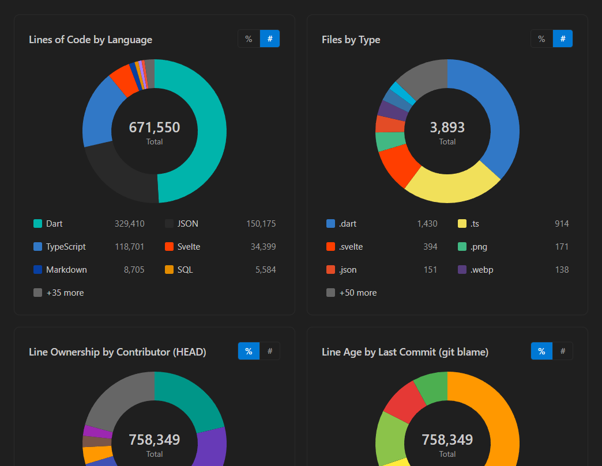
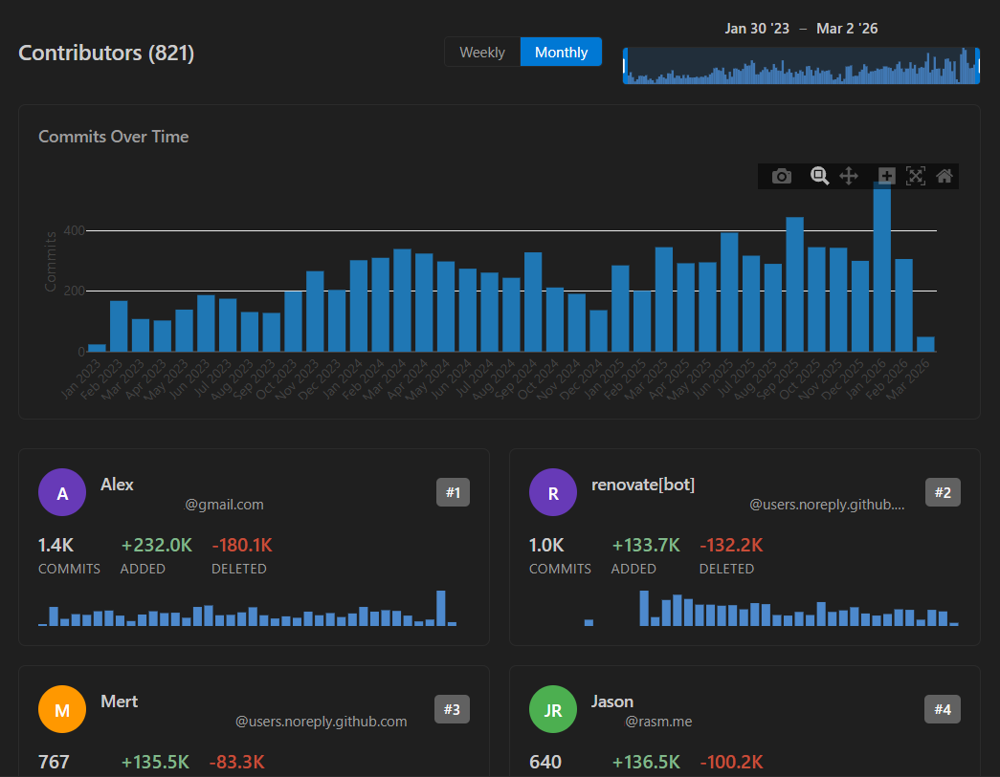
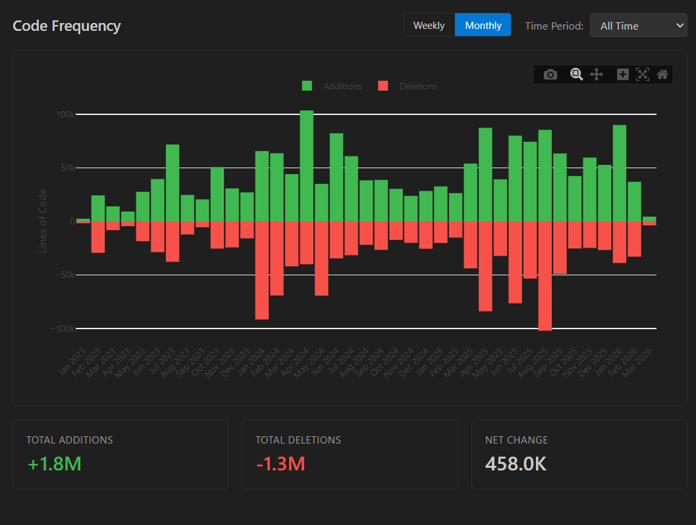
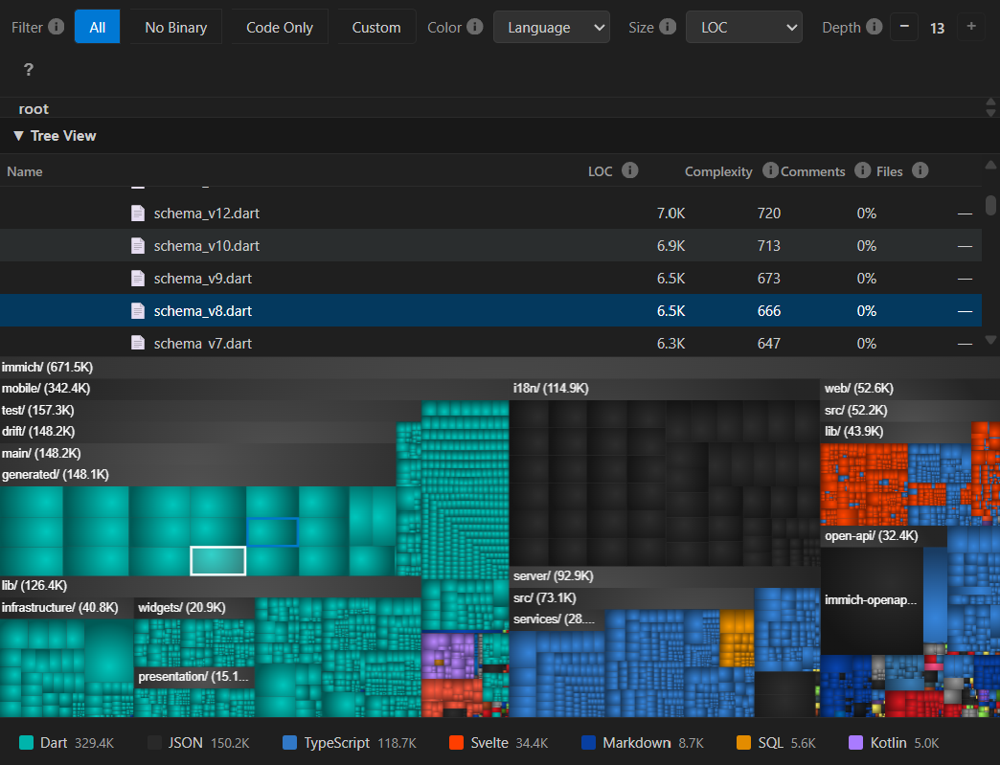

# Repo Stats

[](https://marketplace.visualstudio.com/items?itemName=guwidoe.vscode-repo-stats)
[](https://marketplace.visualstudio.com/items?itemName=guwidoe.vscode-repo-stats)
[](https://opensource.org/licenses/MIT)

Visualize your repository statistics directly in VS Code with interactive dashboards, charts, and treemaps. Get insights into contributor activity, code frequency, and codebase structure at a glance.

## Usage

1. Open a folder containing a Git repository
2. Run the command **Repo Stats: Show Dashboard** from the Command Palette (Ctrl+Shift+P / Cmd+Shift+P)
3. Or click the **Repo Stats** button in the status bar

Results are cached based on the current Git HEAD, so subsequent opens are instant.

| Command                      | Description                   |
| ---------------------------- | ----------------------------- |
| `Repo Stats: Show Dashboard` | Open the statistics dashboard |
| `Repo Stats: Refresh`        | Clear cache and re-analyze    |

## Screenshots

<table>
  <tr>
    <td width="50%">
      
      <br/><em>Overview Dashboard</em>
    </td>
    <td width="50%">
      
      <br/><em>Contributors Panel</em>
    </td>
  </tr>
  <tr>
    <td width="50%">
      
      <br/><em>Code Frequency</em>
    </td>
    <td width="50%">
      
      <br/><em>Repository Treemap</em>
    </td>
  </tr>
</table>

## Features

### Overview Dashboard

- Total files, lines of code, and language distribution
- Donut charts for LOC by language and files by type
- Largest files in the codebase (excluding generated)
- Generated file and binary file detection

### Contributors Dashboard

- Commits over time chart (weekly/monthly granularity)
- Lines added and deleted per contributor
- Interactive time range slider with activity preview
- Per-contributor sparkline charts

### Code Frequency

- Stacked bar chart showing additions/deletions over time
- Summary cards with total additions, deletions, and net change
- Weekly or monthly granularity toggle

### Repository Treemap

- **WizTree-inspired design** with nested hierarchy and vignette shading
- **Color modes**: By language (GitHub Linguist colors) or by file age (heat map)
- **Size modes**: Lines of code, file size in bytes, or file count
- **Adjustable nesting depth** (1-10 levels)
- **Smart filtering**: Presets for All, No Binary, Code Only, or custom language selection
- **Rich interactions**: Click to drill down, double-click to open files, right-click context menu
- **Keyboard navigation**: Escape to clear selection, Backspace to go up

### Settings Panel

Configure exclude patterns, generated file patterns, binary extensions, max commits to analyze, and default color mode.

## Installation

### From VS Code Marketplace

1. Open VS Code
2. Go to Extensions (Ctrl+Shift+X / Cmd+Shift+X)
3. Search for "Repo Stats"
4. Click **Install**

### From VSIX

1. Download the `.vsix` file from [Releases](https://github.com/guwidoe/vscode-repo-stats/releases)
2. In VS Code, open the Command Palette (Ctrl+Shift+P / Cmd+Shift+P)
3. Run `Extensions: Install from VSIX...`
4. Select the downloaded file

## Requirements

- **VS Code** 1.85.0 or higher
- **Git** must be installed and available in PATH
- **scc** (Sloc Cloc and Code) - automatically downloaded if not found in PATH

### About scc

This extension uses [scc](https://github.com/boyter/scc) for accurate lines-of-code counting. It's a fast, accurate code counter that supports 200+ languages.

- If `scc` is in your PATH, the extension uses it directly
- If not found, the extension automatically downloads the appropriate binary for your platform
- Supported platforms: Windows (x64, arm64), macOS (x64, arm64), Linux (x64, arm64)

## Extension Settings

| Setting                         | Default      | Description                                         |
| ------------------------------- | ------------ | --------------------------------------------------- |
| `repoStats.excludePatterns`     | `[]`         | Additional directories to exclude beyond .gitignore |
| `repoStats.maxCommitsToAnalyze` | `10000`      | Maximum commits to analyze (for performance)        |
| `repoStats.defaultColorMode`    | `"language"` | Default treemap color mode (`language` or `age`)    |
| `repoStats.generatedPatterns`   | See below    | Glob patterns to identify generated files           |
| `repoStats.binaryExtensions`    | See below    | File extensions considered as binary                |

<details>
<summary>Default Generated Patterns</summary>

```json
[
  "**/generated/**", "**/gen/**", "**/__generated__/**",
  "**/dist/**", "**/build/**", "**/*.generated.*",
  "**/*.min.js", "**/*.min.css", "**/package-lock.json", "..."
]
```

</details>

<details>
<summary>Default Binary Extensions</summary>

```json
[".png", ".jpg", ".gif", ".mp4", ".mp3", ".ttf", ".woff2", ".zip", ".exe", ".pdf", "..."]
```

</details>

## Performance

Repo Stats is designed to handle large repositories efficiently:

- **Caching**: Results cached by Git HEAD SHA - instant reload if no new commits
- **Progress reporting**: Visual feedback during analysis
- **Commit limits**: Configurable maximum commits to analyze
- **Canvas rendering**: Treemap uses HTML5 Canvas for smooth performance with 50K+ files

For very large repositories, consider reducing `maxCommitsToAnalyze` or adding exclude patterns for large vendored directories.

## Known Issues

- **Large monorepos**: First analysis may take longer; subsequent loads are cached
- **Submodules**: Automatically detected and excluded from analysis
- **Binary files**: Shown in treemap with 0 LOC; use "Size (Bytes)" mode to see their actual size

## Contributing

Contributions are welcome! Please see the [GitHub repository](https://github.com/guwidoe/vscode-repo-stats) for:

- [Issue tracker](https://github.com/guwidoe/vscode-repo-stats/issues)
- Development setup instructions
- Contribution guidelines

### Development

```bash
# Clone and install
git clone https://github.com/guwidoe/vscode-repo-stats.git
cd vscode-repo-stats
npm install && cd webview-ui && npm install && cd ..

# Build / Watch / Test / Package
npm run build
npm run watch
npm run test
npm run package
```

## Release Notes

### 0.0.1

Initial release with Overview, Contributors, Code Frequency, Treemap, and Settings panels.

## License

[MIT](LICENSE)

---

**Enjoy!** If you find this extension useful, please consider [leaving a review](https://marketplace.visualstudio.com/items?itemName=guwidoe.vscode-repo-stats&ssr=false#review-details) or [starring the repository](https://github.com/guwidoe/vscode-repo-stats).
