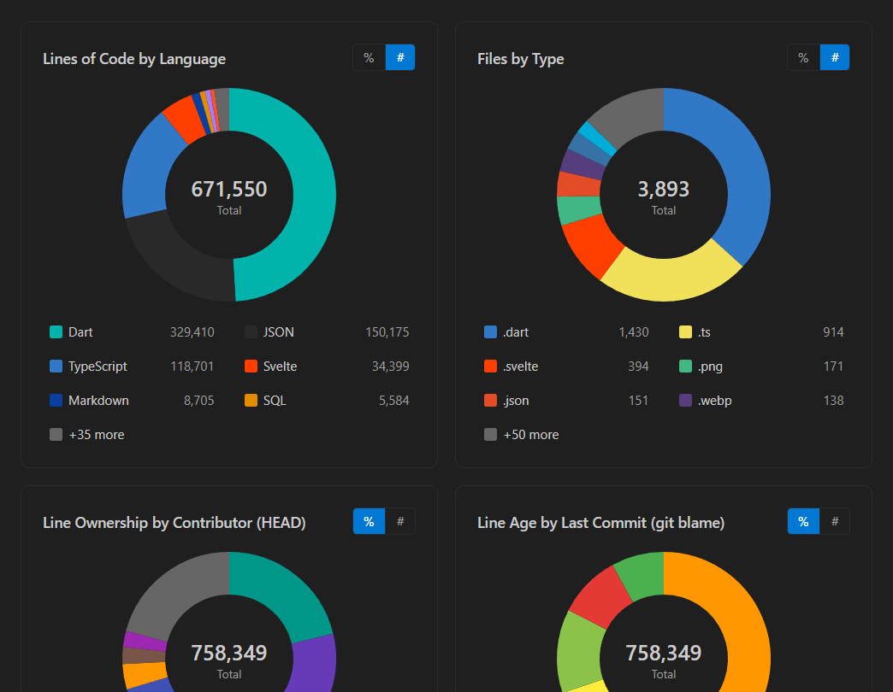
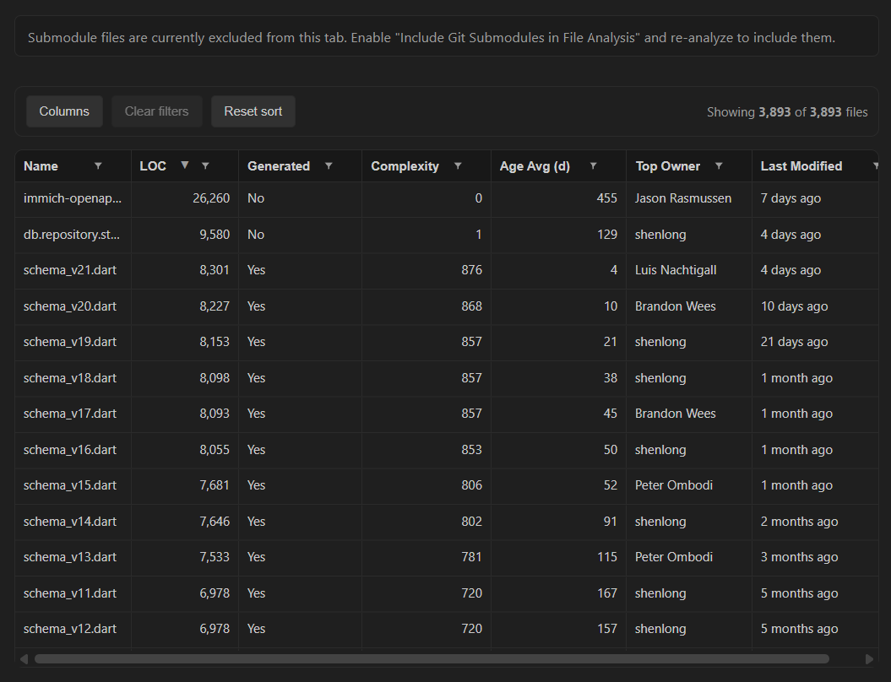
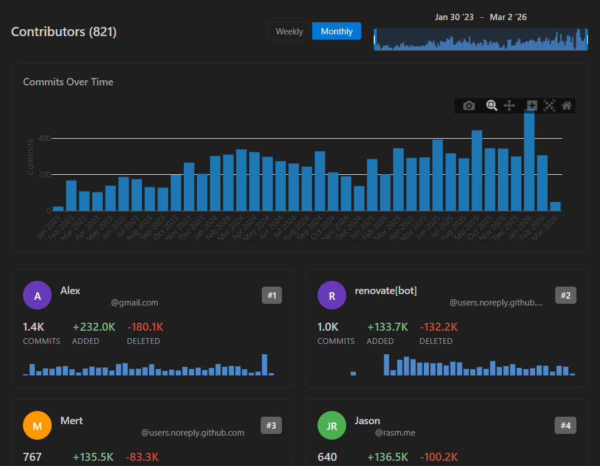
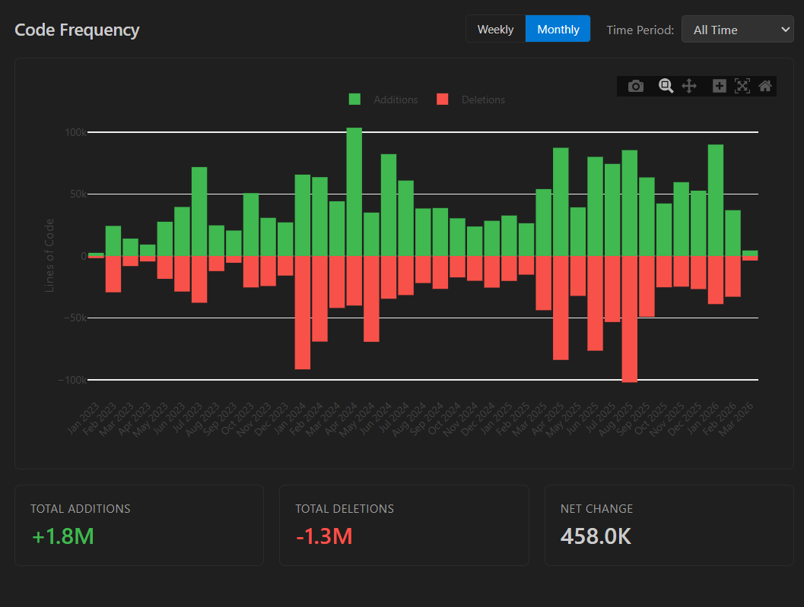
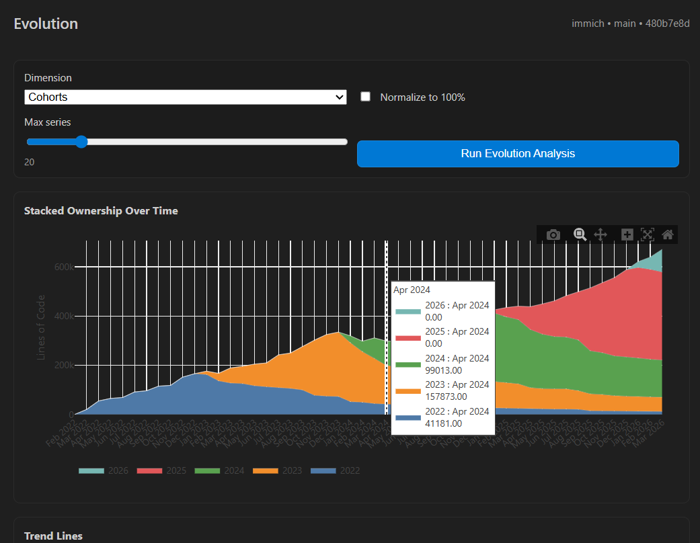
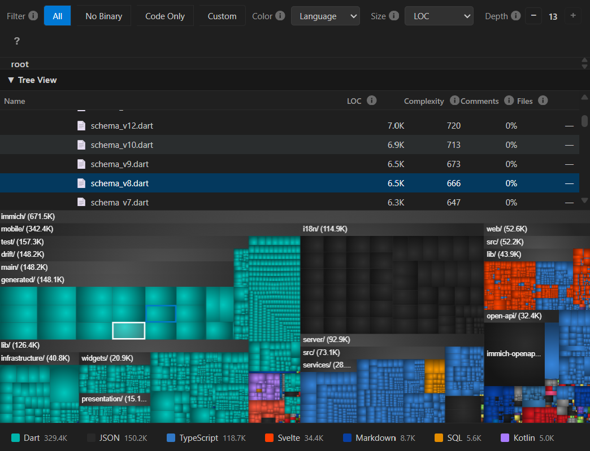

# Repo Stats

[](https://marketplace.visualstudio.com/items?itemName=guwidoe.vscode-repo-stats)
[](https://marketplace.visualstudio.com/items?itemName=guwidoe.vscode-repo-stats)
[](https://opensource.org/licenses/MIT)

Visualize your repository statistics directly in VS Code with interactive dashboards, charts, treemaps, and evolution analytics. Get insights into contributor activity, code frequency, code ownership trends, and codebase structure at a glance.

## Usage

1. Open a workspace folder (single repo, monorepo, or multi-repo workspace)
2. Run the command **Repo Stats: Show Dashboard** from the Command Palette (Ctrl+Shift+P / Cmd+Shift+P)
3. Or click the **Repo Stats** button in the status bar

Results are cached based on the current Git HEAD, so subsequent opens are instant.

| Command                           | Description                                              |
| --------------------------------- | -------------------------------------------------------- |
| `Repo Stats: Show Dashboard`      | Open the statistics dashboard                            |
| `Repo Stats: Refresh`             | Clear cache and re-analyze                               |
| `Repo Stats: Select Repositories` | Include/exclude repositories in the current aggregation |
| `Repo Stats: Add Repository`      | Add another local repository folder to the workspace     |

## Screenshots

<table>
  <tr>
    <td width="50%">
      
      <br/><em>Overview Dashboard</em>
    </td>
    <td width="50%">
      
      <br/><em>Files Panel</em>
    </td>
  </tr>
  <tr>
    <td width="50%">
      
      <br/><em>Contributors Panel</em>
    </td>
    <td width="50%">
      
      <br/><em>Code Frequency</em>
    </td>
  </tr>
  <tr>
    <td width="50%">
      
      <br/><em>Evolution Analysis</em>
    </td>
    <td width="50%">
      
      <br/><em>Repository Treemap</em>
    </td>
  </tr>
</table>

## Features

### Overview Dashboard

- Total files, lines of code, and language distribution
- Donut charts for LOC by language and files by type
- HEAD blame charts for line ownership by contributor and line age buckets
- Generated file, binary file, and blame-analysis coverage indicators

### Files Explorer

- Full repository file list with rich metadata columns
- Header-level per-column filtering (text, number range, boolean, date)
- Column manager for show/hide and reordering
- Sortable columns (default: LOC descending, supports multi-column sort)
- Includes blame-derived file metadata (blamed LOC, line-age stats, top owner)
- Virtualized rendering for smooth performance on large repositories

### Contributors Dashboard

- Commits over time chart (weekly/monthly granularity)
- Lines added and deleted per contributor
- Interactive time range slider with activity preview
- Per-contributor sparkline charts

### Code Frequency

- Stacked bar chart showing additions/deletions over time
- Summary cards with total additions, deletions, and net change
- Weekly or monthly granularity toggle

### Evolution (On-Demand)

- **Git-of-theseus style ownership timelines** (inspired by repository evolution analysis)
- **Dimensions**: Cohorts, authors, extensions, top-level directories, and email domains
- **Chart suite**: Stacked ownership view, line trends, and latest distribution
- **On-demand execution** with dedicated cache, stale-state detection, and recompute button
- **Performance controls**: Snapshot interval, max snapshots, cohort format, and max displayed series

### Repository Treemap

- **WizTree-inspired design** with nested hierarchy and vignette shading
- **Color modes**: By language (GitHub Linguist colors), file age, complexity, or code density
- **Size modes**: Lines of code, file size in bytes, or file count
- **Adjustable nesting depth** (1-10 levels)
- **Smart filtering**: Presets for All, No Binary, Code Only, or custom language selection
- **Rich interactions**: Click to drill down, double-click to open files, right-click context menu
- **Keyboard navigation**: Escape to clear selection, Backspace to go up

### Settings Panel

Configure analysis scope, chart granularity, overview display mode, treemap tooltip fields, generated file patterns, binary extensions, and Evolution sampling controls. Multi-repository analysis comes from repository membership selection (include/exclude exactly the repositories you want to aggregate).

## Installation

### From VS Code Marketplace

1. Open VS Code
2. Go to Extensions (Ctrl+Shift+X / Cmd+Shift+X)
3. Search for "Repo Stats"
4. Click **Install**

### From VSIX

1. Download the `.vsix` file from [Releases](https://github.com/guwidoe/vscode-repo-stats/releases)
2. In VS Code, open the Command Palette (Ctrl+Shift+P / Cmd+Shift+P)
3. Run `Extensions: Install from VSIX...`
4. Select the downloaded file

## Requirements

- **VS Code** 1.110.0 or higher
- **Git** must be installed and available in PATH
- **scc** (Sloc Cloc and Code) - automatically downloaded if not found in PATH

### About scc

This extension uses [scc](https://github.com/boyter/scc) for accurate lines-of-code counting. It's a fast, accurate code counter that supports 200+ languages.

- If `scc` is in your PATH, the extension uses it directly
- If not found, the extension automatically downloads the appropriate binary for your platform
- Supported platforms: Windows (x64, arm64), macOS (x64, arm64), Linux (x64, arm64)

## Extension Settings

| Setting | Default | Description |
| --- | --- | --- |
| `repoStats.excludePatterns` | `[]` | Additional file or folder exclude patterns beyond `.gitignore` |
| `repoStats.maxCommitsToAnalyze` | `10000` | Maximum commits to analyze for history-based views |
| `repoStats.defaultColorMode` | `"language"` | Default treemap color mode (`language`, `age`, `complexity`, or `density`) |
| `repoStats.showEmptyTimePeriods` | `true` | Show weeks/months with no activity in charts |
| `repoStats.defaultGranularityMode` | `"auto"` | Default chart granularity (`auto`, `weekly`, or `monthly`) |
| `repoStats.autoGranularityThreshold` | `20` | Weekly/monthly cutoff used when granularity is `auto` |
| `repoStats.overviewDisplayMode` | `"percent"` | Display overview values as percentages or counts |
| `repoStats.generatedPatterns` | See below | Glob patterns used to identify generated files |
| `repoStats.binaryExtensions` | See below | File extensions treated as binary |
| `repoStats.locExcludedExtensions` | `[]` | File extensions excluded from LOC counting |
| `repoStats.tooltipSettings` | See `package.json` | Configure which metrics appear in treemap tooltips |
| `repoStats.evolution.autoRun` | `false` | Auto-run evolution analysis when data is stale or missing |
| `repoStats.evolution.snapshotIntervalDays` | `30` | Days between sampled evolution snapshots |
| `repoStats.evolution.maxSnapshots` | `80` | Maximum historical snapshots analyzed in Evolution |
| `repoStats.evolution.maxSeries` | `20` | Default maximum visible series in Evolution charts |
| `repoStats.evolution.cohortFormat` | `"%Y"` | Cohort grouping format (`%Y`, `%Y-%m`, `%Y-W%W`) |

Tip: If assets like `.svg` files inflate LOC totals for your project, add `.svg` to `repoStats.locExcludedExtensions`.

`repoStats.excludePatterns` accepts simple directory names (`vendor`), repo-relative paths (`backend/fixtures`), exact repo-root paths prefixed with `/` (`/src`, `/README.md`), and glob-style patterns (`**/backend/fixtures/**`).

The following settings can be saved per-repository via the Settings UI and VS Code workspace-folder settings (`.vscode/settings.json`) when repo scope is available: `excludePatterns`, `generatedPatterns`, `binaryExtensions`, `locExcludedExtensions`, `maxCommitsToAnalyze`, `evolution.snapshotIntervalDays`, `evolution.maxSnapshots`, `evolution.maxSeries`, and `evolution.cohortFormat`.

Use the repository selector in the header (or `Repo Stats: Select Repositories`) to decide exactly which repositories participate in aggregation. Convenience actions include `All`, `Top-level`, and `None`.

<details>
<summary>Default Generated Patterns</summary>

```json
[
  "**/generated/**", "**/gen/**", "**/__generated__/**",
  "**/dist/**", "**/build/**", "**/*.generated.*",
  "**/*.min.js", "**/*.min.css", "**/package-lock.json", "..."
]
```

</details>

<details>
<summary>Default Binary Extensions</summary>

```json
[".png", ".jpg", ".gif", ".mp4", ".mp3", ".ttf", ".woff2", ".zip", ".exe", ".pdf", "..."]
```

</details>

## Performance

Repo Stats is designed to handle large repositories efficiently:

- **Caching**: Results cached by target revision hash - instant reload if no member repo changed
- **Progress reporting**: Visual feedback during analysis
- **Commit limits**: Configurable maximum commits to analyze
- **On-demand evolution cache**: Heavy blame-based evolution analysis only runs when requested and is cached separately
- **Canvas rendering**: Treemap uses HTML5 Canvas for smooth performance with 50K+ files

For very large repositories, consider reducing `maxCommitsToAnalyze` or adding exclude patterns for large vendored directories.

Evolution analysis is cached separately from the main dashboard data. If any selected repository changes, Evolution data is marked stale in the Evolution tab until you recompute it.

## Known Issues

- **Large monorepos / large repository selections**: First analysis may take longer; subsequent loads are cached
- **Multi-repository analysis**: Selecting many repositories can take longer than single-repo analysis, especially in Evolution
- **Binary files**: Shown in treemap with 0 LOC; use "Size (Bytes)" mode to see their actual size

## Contributing

Contributions are welcome! Please see the [GitHub repository](https://github.com/guwidoe/vscode-repo-stats) for:

- [Issue tracker](https://github.com/guwidoe/vscode-repo-stats/issues)
- Development setup instructions
- Contribution guidelines

### Development

```bash
# Clone and install
git clone https://github.com/guwidoe/vscode-repo-stats.git
cd vscode-repo-stats
npm install && cd webview-ui && npm install && cd ..

# Build / Watch / Test / Package
npm run build
npm run watch
npm run test
npm run package
```

### Analysis performance benchmarks

Repo Stats now includes a deterministic analysis benchmark harness so analysis performance can be tracked over time without relying on whatever repository happens to be open locally.

Local benchmark commands:

```bash
# list deterministic benchmark targets
npm run bench:analysis:list

# run the full benchmark suite locally
npm run bench:analysis

# record a baseline for the current commit
npm run bench:record

# compare against the previously recorded baseline
npm run bench:compare-prev
```

The benchmark harness generates deterministic synthetic Git repositories under `.bench-results/workspaces/analysis/`, warms the `scc` binary outside the measured window, and records per-method timing totals for the analysis pipeline (`getCommitAnalytics`, `countLines`, `raw` blame calls, and related steps).

For more comparable benchmark history, use the remote async runner on a quieter machine. It stages immutable code snapshots, serializes benchmark jobs behind a remote lock, and can wait for the remote machine to become mostly idle before starting a run:

```bash
cp ./tools/remote_benchmark.env.example ./tools/remote_benchmark.env
# fill in SSH target, machine name, and stage dir first

npm run bench:remote:check
./tools/remote_benchmark_async.sh start record
./tools/remote_benchmark_async.sh wait "$(./tools/remote_benchmark_async.sh latest)"
```

This workflow is intentionally separate from `npm run validate`. Performance benchmarks are useful regression tools, but they are too environment-sensitive and expensive to make every normal validation run block on them.

## License

[MIT](LICENSE)

---

**Enjoy!** If you find this extension useful, please consider [leaving a review](https://marketplace.visualstudio.com/items?itemName=guwidoe.vscode-repo-stats&ssr=false#review-details) or [starring the repository](https://github.com/guwidoe/vscode-repo-stats).
