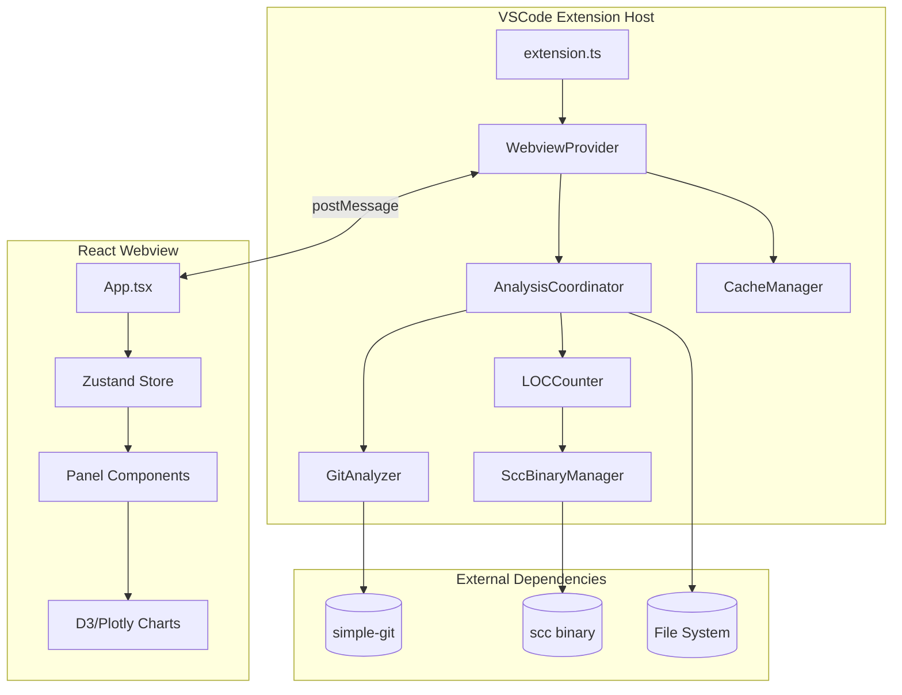
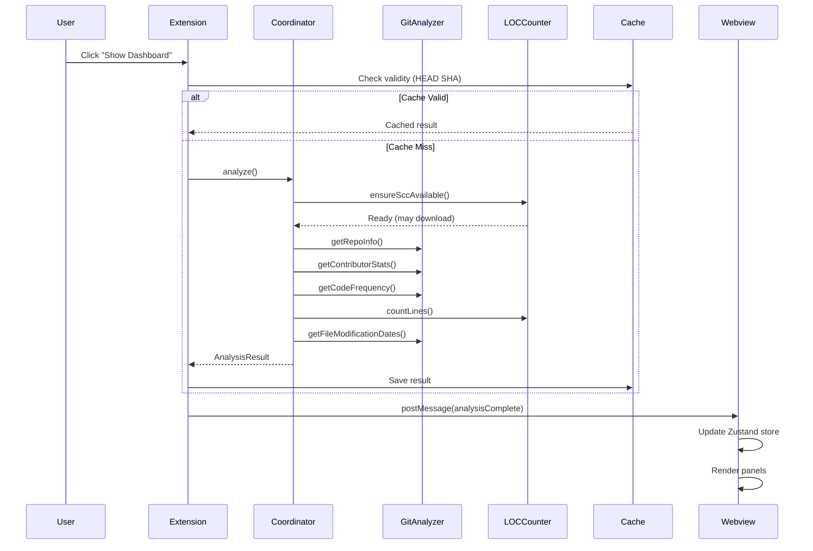

# Codebase Map

> Auto-generated by Cartographer. Last mapped: 2026-01-21

## System Overview

A VSCode extension for visualizing repository statistics with interactive dashboards for contributors, code frequency, and file treemaps.



## Architecture Layers

```
┌─────────────────────────────────────────────────────────┐
│  VSCode Integration Layer (thin)                        │
│  - extension.ts: activate/deactivate                    │
│  - WebviewProvider: postMessage bridge                  │
└─────────────────────────────────────────────────────────┘
                          │ calls
                          ▼
┌─────────────────────────────────────────────────────────┐
│  Core Business Logic (NO VSCode imports)                │
│  - AnalysisCoordinator: orchestrates analysis           │
│  - GitAnalyzer: git operations via simple-git           │
│  - LOCCounter: lines of code via scc                    │
│  - CacheManager: analysis result caching                │
└─────────────────────────────────────────────────────────┘
                          │ uses
                          ▼
┌─────────────────────────────────────────────────────────┐
│  External Dependencies (injectable)                     │
│  - simple-git (git operations)                          │
│  - scc binary (LOC counting, auto-downloads)            │
│  - Node.js fs, crypto, child_process                    │
└─────────────────────────────────────────────────────────┘
```

## Directory Structure

```
VSCode-repo-stats/
├── src/                          # Extension host (TypeScript)
│   ├── extension.ts              # Entry point, command registration
│   ├── analyzers/                # Core analysis logic (VSCode-free)
│   │   ├── coordinator.ts        # Orchestrates all analysis phases
│   │   ├── gitAnalyzer.ts        # Git operations via simple-git
│   │   ├── locCounter.ts         # LOC counting via scc wrapper
│   │   └── sccBinaryManager.ts   # scc binary resolution/download
│   ├── cache/                    # Analysis caching
│   │   └── cacheManager.ts       # Cache by git SHA
│   ├── types/                    # Shared type definitions
│   │   └── index.ts              # Messages, data models, errors
│   └── webview/                  # VSCode webview integration
│       └── provider.ts           # Webview lifecycle & messaging
│
├── webview-ui/                   # React webview (Vite build)
│   ├── src/
│   │   ├── App.tsx               # Root component, view switching
│   │   ├── main.tsx              # Entry point
│   │   ├── types.ts              # Frontend type definitions
│   │   ├── components/           # UI components (1 per file)
│   │   │   ├── Navigation.tsx    # Tab navigation
│   │   │   ├── about/            # About panel
│   │   │   ├── common/           # Shared components (InfoTooltip)
│   │   │   ├── contributors/     # Contributors dashboard
│   │   │   ├── frequency/        # Code frequency chart
│   │   │   ├── overview/         # Overview statistics
│   │   │   ├── settings/         # Settings panel
│   │   │   └── treemap/          # Interactive treemap
│   │   │       ├── hooks/        # Layout, render, interaction hooks
│   │   │       └── utils/        # Colors, vignette, layout helpers
│   │   ├── hooks/                # Custom React hooks
│   │   │   ├── useVsCodeApi.ts   # Extension communication
│   │   │   └── useOverviewStats.ts # Overview computations
│   │   ├── store/                # Zustand state management
│   │   │   └── index.ts          # Central store with selectors
│   │   └── utils/                # Utility functions
│   │       ├── colors.ts         # Language colors, formatting
│   │       └── fileTypes.ts      # Binary/code classification
│   └── test/                     # Webview tests
│
├── test/                         # Extension tests
│   └── e2e/                      # E2E tests (vscode-extension-tester)
│
├── docs/                         # Documentation
│   └── plans/                    # Implementation plans
│
├── .claude/                      # Claude Code configuration
│   └── skills/                   # Reusable development skills
│
└── Orchestration Setup Resources/ # AI development guides
```

## Module Guide

### Extension Host (src/)

#### extension.ts
**Purpose**: Extension activation entry point
**Entry point**: Yes - activated by VSCode
**Exports**: `activate()`, `deactivate()`
**Dependencies**: vscode, WebviewProvider
**Gotchas**: Only file that should import vscode in main flow

#### analyzers/coordinator.ts
**Purpose**: Orchestrates all analysis operations (8 phases)
**Exports**: `AnalysisCoordinator`, `createAnalysisCoordinator()`
**Dependencies**: GitAnalyzer, LOCCounter, types
**Patterns**: Dependency injection, progress callbacks
**Gotchas**:
- Submodules auto-detected and excluded
- Binary files added with 0 LOC but actual bytes
- Batch processing (50 files) for metadata enrichment

#### analyzers/gitAnalyzer.ts
**Purpose**: Git operations via simple-git
**Exports**: `GitClient` interface, `GitAnalyzer`, `createGitAnalyzer()`
**Dependencies**: simple-git
**Patterns**: Interface-based DI, custom error types
**Gotchas**:
- Two-pass approach for commits (with/without stats)
- ISO week format (YYYY-Www) for time data
- Contributors keyed by lowercase email

#### analyzers/locCounter.ts
**Purpose**: Lines of code counting via scc binary
**Exports**: `LOCClient` interface, `LOCCounter`, `createLOCCounter()`
**Dependencies**: SccBinaryManager
**Patterns**: Wrapper pattern (never call scc directly)
**Gotchas**:
- MUST call `ensureSccAvailable()` before `countLines()`
- scc respects .gitignore automatically
- 50MB buffer for large repos

#### analyzers/sccBinaryManager.ts
**Purpose**: scc binary resolution and auto-download
**Exports**: `SccBinaryManager`, `createSccBinaryManager()`
**Dependencies**: Node.js https, fs, child_process
**Patterns**: Fallback strategy (PATH first, then download)
**Gotchas**:
- Downloads from GitHub releases if not in PATH
- Platform-specific archives (tar.gz/zip)
- Verifies with --version after download

#### cache/cacheManager.ts
**Purpose**: Caches analysis results by git SHA
**Exports**: `CacheManager`, `CacheStorage` interface
**Dependencies**: Node.js crypto
**Patterns**: Abstract storage interface for testability
**Gotchas**:
- Cache valid only if SHA matches HEAD
- Bump version when CacheStructure changes

#### webview/provider.ts
**Purpose**: Webview lifecycle and postMessage bridge
**Exports**: `RepoStatsProvider`, `WorkspaceStateStorage`
**Dependencies**: vscode, AnalysisCoordinator, CacheManager
**Patterns**: Adapter pattern, message-based communication
**Gotchas**:
- CSP with nonces for security
- HTML rewriting for webview asset paths
- Settings sent multiple times to ensure delivery

#### types/index.ts
**Purpose**: Shared type definitions (VSCode-independent)
**Exports**: All data types, message types, error classes
**Patterns**: Discriminated unions for messages
**Gotchas**:
- `TreemapNode.binary` flag for non-code files
- ISO date strings for all timestamps

### Webview UI (webview-ui/)

#### App.tsx
**Purpose**: Root component, view switching, state initialization
**Exports**: `App`
**Dependencies**: All panels, Navigation, useVsCodeApi, Zustand store
**Patterns**: View switching based on activeView state
**Gotchas**: Settings/About work without data

#### store/index.ts
**Purpose**: Centralized Zustand state management
**Exports**: `useStore`, memoized selectors
**Patterns**: Manual caching for expensive computations
**Gotchas**:
- ISO week validation prevents malformed data
- Treemap filter recalculates directory LOC
- Binary files auto-hidden in LOC mode

#### hooks/useVsCodeApi.ts
**Purpose**: Bridge to VSCode extension host
**Exports**: `useVsCodeApi`
**Patterns**: Singleton API, mock fallback for dev
**Messages**: requestAnalysis, openFile, updateSettings, etc.

#### components/treemap/
**Purpose**: Interactive file treemap visualization
**Key Files**:
- `TreemapPanel.tsx` - Orchestration
- `TreemapCanvas.tsx` - Canvas rendering with interactions
- `hooks/useTreemapLayout.ts` - D3 layout computation
- `hooks/useTreemapRender.ts` - Multi-pass canvas rendering
- `utils/vignette.ts` - WizTree-style shading

**Patterns**:
- Canvas for performance (thousands of nodes)
- Throttled mouse events (16ms)
- Keyboard navigation (Escape, Backspace)

#### components/contributors/
**Purpose**: Contributors dashboard with charts
**Key Files**:
- `ContributorsPanel.tsx` - Main panel with pagination
- `ContributorCard.tsx` - Per-contributor stats with sparkline
- `CommitsChart.tsx` - Plotly bar chart
- `TimeRangeSlider.tsx` - GitHub-style range selector

**Patterns**: useDeferredValue for responsive UI

#### components/overview/
**Purpose**: Repository statistics at a glance
**Key Files**:
- `OverviewPanel.tsx` - Dashboard with stat cards
- `DonutChart.tsx` - SVG donut with hover
- `StatCard.tsx` - Big number display

## Data Flow

### Analysis Flow



### Message Types

**Extension → Webview:**
- `analysisStarted` - Analysis beginning
- `analysisProgress` - Progress update (phase, percentage)
- `analysisComplete` - Full result with data
- `analysisError` - Error message
- `settingsLoaded` - Current settings

**Webview → Extension:**
- `requestAnalysis` - Start analysis
- `requestRefresh` - Clear cache and re-analyze
- `openFile` - Open file in editor
- `revealInExplorer` - Show in file explorer
- `copyPath` - Copy path to clipboard
- `updateSettings` - Save settings

## Conventions

### Code Style
- TypeScript strict mode enabled
- Functional React components only (no classes)
- Max 400 LOC per file (eslint enforced)
- One React component per file (eslint enforced)
- Zustand for webview state (not Redux/Context)

### Architecture Rules
- NO `import * as vscode` in core logic (only integration layer)
- Dependency injection for all external dependencies
- Interfaces for mockable components
- Never call scc directly - use LOCCounter wrapper
- Worker Threads for operations >100ms

### Testing
- Unit tests: Vitest (webview + src core logic)
- Integration tests: @vscode/test-electron
- E2E tests: vscode-extension-tester
- Coverage thresholds: 70% statements/functions/lines, 60% branches

## Gotchas

1. **scc Binary**: Must call `ensureSccAvailable()` before `countLines()` - will auto-download if missing
2. **Cache Invalidation**: Only valid if git HEAD SHA matches cached SHA
3. **Binary Files**: Added to treemap with 0 LOC but actual bytes; auto-hidden in LOC size mode
4. **Submodules**: Auto-detected and excluded from analysis
5. **ISO Weeks**: Format is `YYYY-Www` (e.g., "2025-W03") - validated to prevent malformed dates
6. **Commit Limit**: `limitReached` flag warns when maxCommitsToAnalyze was hit
7. **Treemap Canvas**: Uses devicePixelRatio for HiDPI; throttles mouse events to 16ms
8. **Settings Delivery**: Sent multiple times (100ms delay + after analysis) to ensure webview receives them
9. **Large Repos**: Batch processing (50 files) for metadata enrichment to avoid overwhelming fs

## Navigation Guide

**To add a new panel/view:**
1. Create component in `webview-ui/src/components/<name>/`
2. Add to `ViewType` in `webview-ui/src/types.ts`
3. Add navigation item in `Navigation.tsx`
4. Add case in `App.tsx` view switch

**To add a new analysis feature:**
1. Add types in `src/types/index.ts`
2. Add method to GitAnalyzer or LOCCounter
3. Call from AnalysisCoordinator with progress reporting
4. Update AnalysisResult type
5. Add to cache structure (bump cache version)

**To modify treemap rendering:**
1. Layout: `useTreemapLayout.ts` (D3 hierarchy)
2. Rendering: `useTreemapRender.ts` (Canvas2D passes)
3. Colors: `treemap/utils/colors.ts`
4. Interactions: `TreemapCanvas.tsx` event handlers

**To add a new message type:**
1. Add to `ExtensionMessage` or `WebviewMessage` in `src/types/index.ts`
2. Mirror in `webview-ui/src/types.ts`
3. Handle in `provider.ts` (extension) or `useVsCodeApi.ts` (webview)

**To run validation before commit:**
```bash
npm run validate  # typecheck + lint + test + package
```
